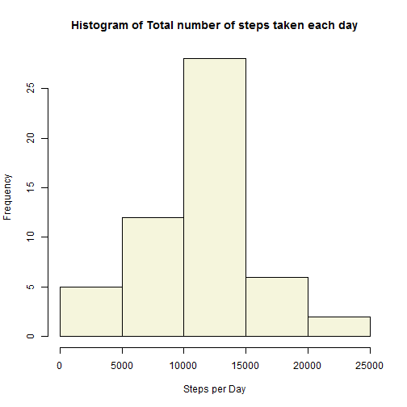
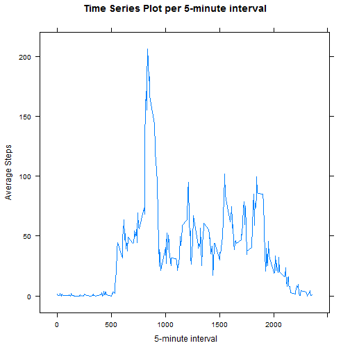
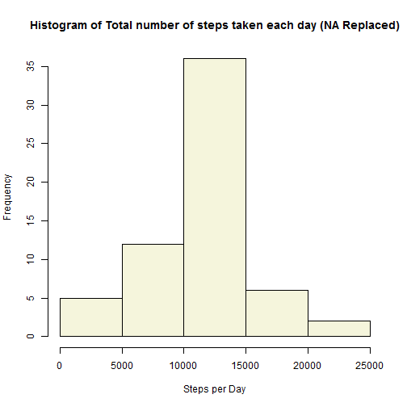

# Reproducible Research Peer Assignment - Markdown document 
## Reading / Processing the Data 
### Loading Libraries 

```r
library(lattice)
library(plyr)
```
### Load the data 

```r
act<-read.csv("activity.csv",header=TRUE,sep=",")
summary(act)
```

```
##      steps            date              interval     
##  Min.   :  0.00   Length:17568       Min.   :   0.0  
##  1st Qu.:  0.00   Class :character   1st Qu.: 588.8  
##  Median :  0.00   Mode  :character   Median :1177.5  
##  Mean   : 37.38                      Mean   :1177.5  
##  3rd Qu.: 12.00                      3rd Qu.:1766.2  
##  Max.   :806.00                      Max.   :2355.0  
##  NA's   :2304
```
### Process/transform the data 
* Changing the class of the variable "steps" to be Numeric

```r
act$steps <- as.numeric(act$steps)
```
* Changing the class of the variable "interval" to be Numeric

```r
act$interval <- as.numeric(act$interval)
```
* Removing NAs

```r
Actuals<- act[complete.cases(act),] 
```
## What is mean total number of steps taken per day? 
### Make a histogram of the total number of steps taken each day 

```r
smsteps<- ddply(Actuals, c("date"), function (x) apply(x[1], 2, sum))

hist(smsteps$steps,main="Histogram of Total number of steps taken each day",xlab="Steps per Day",ylab="Frequency",col="beige")
```



### Mean of the steps 

```r
mean(smsteps$steps,na.rm=TRUE) 
```

```
## [1] 10766.19
```
* The **mean** total number of steps taken per day is 1.0766 &times; 10<sup>4</sup> steps.

### Median of the steps 

```r
median(smsteps$steps,na.rm=TRUE)
```

```
## [1] 10765
```
* The **median** total number of steps taken per day is 
1.0765 &times; 10<sup>4</sup> steps.

## What is the average daily activity pattern? 
### Make a time series plot (i.e. type = "l") of the 5-minute interval (x-axis) and the average number of steps taken, averaged across all days (y-axis) 


```r
# Mean of the steps related to each interval
mnsteps<- ddply(Actuals, c("interval"), function (x) apply(x[1], 2, mean))
xyplot(mnsteps$steps ~ mnsteps$interval,type= "l", ylab="Average Steps",
       xlab= " 5-minute interval", main="Time Series Plot per 5-minute interval",lwd=1.0)
```



### Which 5-minute interval, on average across all the days in the dataset, contains the maximum number of steps? 


```r
mnsteps[mnsteps$steps==max(mnsteps$steps),]$interval
```

```
## [1] 835
```
* It is the **835th** interval.

## Imputing missing values 
### Calculate and report the total number of missing values in the dataset 
* Number of missing rows in column 'steps' 

```r
sum(is.na(act$steps))
```

```
## [1] 2304
```
* Number of missing rows in column 'interval'

```r
sum(is.na(act$interval))
```

```
## [1] 0
```
* Number of missing rows in column 'date'

```r
sum(is.na(act$date))
```

```
## [1] 0
```
### Devise a strategy for filling in all of the missing values in the dataset 
Replacing the steps of the rows having NAs with the mean steps for each 5-min interval across the all data 

### Create a new dataset that is equal to the original dataset but with the missing data filled in 

```r
newData<- act
newData[1:288, 1] <- mnsteps$steps 
newData[2017:2304, 1]<- mnsteps$steps
newData[8929:9216, 1]<- mnsteps$steps
newData[9793:10080, 1]<- mnsteps$steps
newData[11233:11520, 1]<- mnsteps$steps
newData[11521:11808, 1]<- mnsteps$steps
newData[12673:12960, 1]<- mnsteps$steps
newData[17281:17568, 1]<- mnsteps$steps
sum(is.na(newData)) # There is no NA.
```

```
## [1] 0
```
### Make a histogram of the total number of steps taken each day 

```r
newSum<- ddply(newData, c("date"), function (x) apply(x[1], 2, sum))

hist(newSum$steps,main="Histogram of Total number of steps taken each day (NA Replaced)",xlab="Steps per Day",ylab="Frequency",col="beige")
```



### Mean of the steps 

```r
newMean<-mean(newSum$steps)
newMean
```

```
## [1] 10766.19
```
* The **mean** total number of steps taken per day is 1.0766 &times; 10<sup>4</sup> steps. 

### Median of the steps 

```r
newMedian<-median(newSum$steps)
newMedian
```

```
## [1] 10766.19
```
* The **median** total number of steps taken per day is 
1.0766 &times; 10<sup>4</sup> steps. 

### Do these values differ from the estimates from the first part of the assignment? What is the impact of imputing missing data on the estimates of the total daily number of steps? 
The **mean** value is the **same** as the value before imputing missing data because we put the mean value for that particular 5-min interval. The median value shows **a little** difference : but it depends on **where the missing values are**. 
## Are there differences in activity patterns between weekdays and weekends? 

### Create a new factor variable in the dataset with two levels - "weekday" and "weekend" indicating whether a given date is a weekday or weekend day  

```r
# Make sure we use English date names
Sys.setlocale("LC_TIME", "English")
```

```
## [1] "English_United States.1252"
```

```r
# Add a new column name of the day(weekday or weekend)
newData$WD<-weekdays(as.Date(newData$date))
newData$WD[newData$WD=="Monday"]="Weekday"
newData$WD[newData$WD=="Tuesday"]="Weekday"
newData$WD[newData$WD=="Wednesday"]="Weekday"
newData$WD[newData$WD=="Thursday"]="Weekday"
newData$WD[newData$WD=="Fridayday"]="Weekday"
newData$WD[newData$WD=="Friday"]="Weekday"
newData$WD[newData$WD=="Saturday"]="Weekend"
newData$WD[newData$WD=="Sunday"]="Weekend"
table(newData$WD)
```

```
## 
## Weekday Weekend 
##   12960    4608
```
### Make a panel plot containing a time series plot (i.e. type = "l") of the 5-minute interval (x-axis) and the average number of steps taken, averaged across all weekday days or weekend days (y-axis). 

```r
new_mnsteps<- ddply(newData, c("interval","WD"), function (x) apply(x[1], 2, mean))

xyplot(new_mnsteps$steps ~ new_mnsteps$interval|new_mnsteps$WD,type="l",ylab="Steps", xlab="Interval",layout=c(1,2))
```


